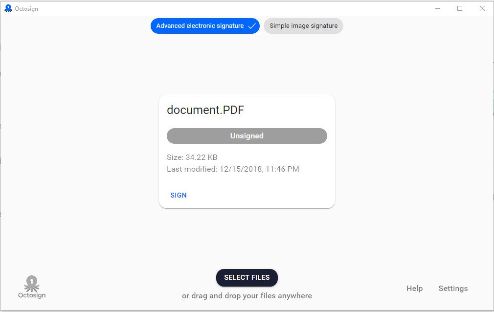
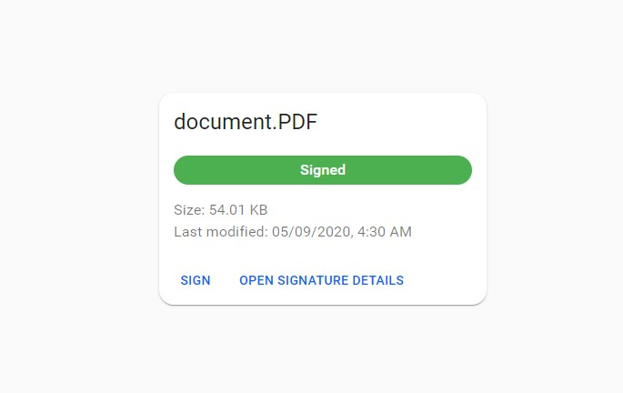
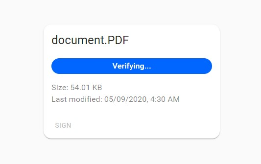
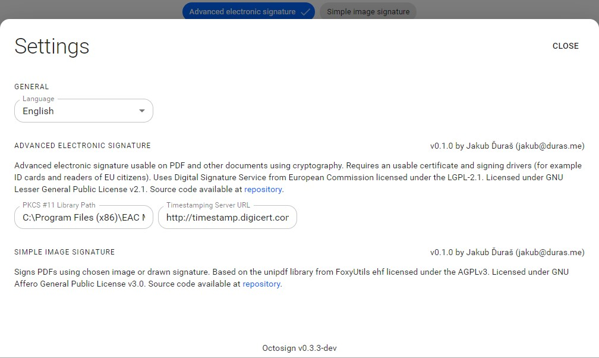

Valid for version 0.5.0-dev.

## Downloading and installing the application

Open the subpage [Download](/sk/download) where you can download the application by clicking on the button for your operating system.

After the download is complete, open the file and follow the instructions.

## Signing the document

First, it is needed to select a document.
To select a document, click on the button "SELECT FILES" or drag and drop your document on the application.
The recommended document type is PDF, although other file types are supported as well.

After selecting the document, a card with the document name will appear just like in the picture.

Signing is possible using several different types of signatures visible in the upper part of the screen.
The default type is "Advanced electronic signature", if available, else "Simple image signature".
When signing with an image, there is only a drawn or picked signature image placed on the PDF.
When signing with an advanced electronic signature, it is possible to use a qualified electronic signature.

To sign a document, press the button "SIGN" visible on the document card.
Follow the instructions, and after the signing is successful, the document will be marked as "Signed".

## Verifying the document signature

Verification of the document signature is automatically started after the document is selected, and it does not have to be triggered manually.

After the verification is completed, the status of the document will be visible on the card of the document, it can be: "Signed", "Unsigned", "Invalid", "Unknown", and "Indeterminate".

If there is at least one signature attached to the document, it is possible to see more information about it by clicking on the button "OPEN SIGNATURE DETAILS".

## Settings

Settings can be opened by clicking on the text "Settings" in the lower right corner of the application.

It is possible to set the language and options specific for the type of the signature.

### Options for advanced electronic signature

Available options are:

- **PKCS #11/#12 Path** - The path is automatically prefilled if there is a supported known software installed on the computer. If not, it is possible to fill it manually with the path that you can get from the supplier of the software bundled with your device. The path needs to lead to a library compliant with the PKCS #11 standard in a 64-bit version or file in the PKCS #12 standard ending with `.p12` or `.pfx`. If left empty, MS CAPI is used on Windows and results in an error on other platforms.
- **Timestamping Server URL** - The URL is automatically prefilled with value "http://timestamp.digicert.com". In the case you would like to use your own timestamping server, feel free to change it, but please make sure to type in the full URL address, including the protocol ("http://" or "https://"). If left empty, no timestamp will be attached to the document.
